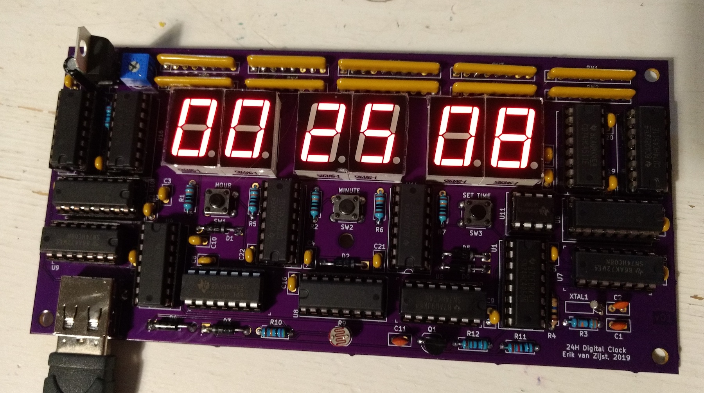

# 24H Digital Clock

This project contains the schematics and PCB layout for a 24-hour digital
quartz clock with self-dimming LED display.

Full write-up is at https://medium.com/@erikvanzijst/a-digital-quartz-clock-from-scratch-a80ec5e427

## Kicad symbol and footprint libraries
The project uses the [DigiKey Kicad symbol and footprint libraries](https://github.com/Digi-Key/digikey-kicad-library).
After cloning or downloading those locally, [add them to the Kicad Symbol and
Footprint libraries](https://forum.digikey.com/t/importing-the-digi-key-kicad-library-into-kicad-5-0-0/4075).
